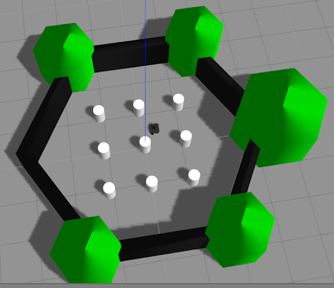
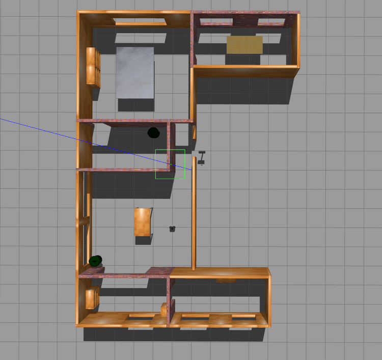
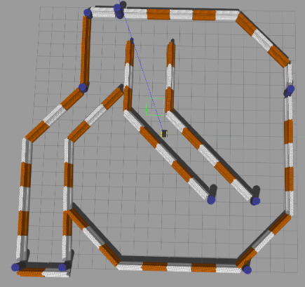

~~Robot~~ Assets Repo
=============================
This repository contains the robot, its model, worlds, launch scripts for simulations in Gazebo.
- [Robot](#Robot)
    - [Build and Run](#Build-and-Run)
    - [Model](#Model)
- [Worlds](#Worlds)
    - [List of worlds](#List-of-worlds)

# Robot
The robot is based on TurtleBot3 with the added Intel RealSense depth camera.

## Build and Run
Build:
```
cd ~/ws
colcon build --symlink-install
```

Source the environment:
```
source install/setup.bash
```

Export the waffle model with the RealSense camera:
```
export TURTLEBOT3_MODEL=waffle_realsense
```

Launching the world in Gazebo:  
```
__NV_PRIME_RENDER_OFFLOAD=1 __GLX_VENDOR_LIBRARY_NAME=nvidia ros2 launch turtlebot3_gazebo <world_name>.launch.py
```
> **Important**  
> Gazebo takes a long time to load worlds. If not all parts of the world start (or the robot does not appear in the world), then run the launch script and Gazebo again.

To control the robot with the keyboard:  
```
ros2 run turtlebot3_teleop teleop_keyboard
```

## Model
The robot model is located in the folder ```<your_ws_path>/assets/turtlebot3_simulations/turtlebot3_gazebo/models/turtlebot3_waffle_realsense/```.  
The path to .urdf file is ```<your_ws_path>/assets/turtlebot3_simulations/turtlebot3_gazebo/urdf/turtlebot3_waffle_realsense.urdf```.

# Worlds
Worlds are stored under the path ```<your_ws_path>/assets/turtlebot3_simulations/turtlebot3_gazebo/worlds/```.  
The models for these worlds are located at ```<your_ws_path>/assets/turtlebot3_simulations/turtlebot3_gazebo/models/<world_name>/```.

## List of worlds
| Name | Launch file | Image |
| ------ | ------ | ------ |
| TurtleBot3 World | turtlebot3_world.launch.py |  |
| TurtleBot3 House | turtlebot3_house.launch.py |  |
| TurtleBot3 DQN Stage 4 | turtlebot3_dqn_stage4.launch.py |  |
| Jackal Race | jackal_race.launch.py |  |
